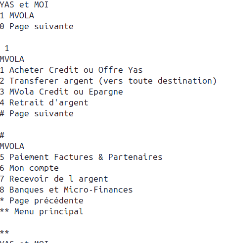

# prog-5-ussd
Une simulation du menu du code ussd #111# de Yas écrit en __Python__ avec les bonnes pratiques.

## Objectifs
Mettre en place un projet Python structuré et maintenable :
- Convention de nommage cohérente
- Linter `flake8` configuré
- Intégration continue avec GitHub Actions
- Code propre et bien documenté

## Conventions de nommage
Voici les conventions de nommage à respecter dans le projet.
- Variables et fonctions: *snake_case*
- Classes: *PascalCase*
- Fichiers: *snake_case*

## Linter 
Le linter utilisé est __flake8__.

## Structure du projet
prog-5-ussd:  
|  
├── ussd     
├── tests  
├── .flake8  
├── .github  
├── requirements.txt  
└──README.md

## Installation 
### 1. Cloner le projet

```bash
git clone https://github.com/HRojotiana/prog-5-ussd.git
cd prog-5-ussd 
```
### 2. Créer un environnement virtuel (.venv)

```bash
python venv .venv
source .venv/bin/activate` #sur linux/macOS
# .\venv\Scripts\activate` #sur Windows
```
### 3. Installation  les dépendances

```bash
pip install -r requirements.txt
```

### 4. Vérification
```bash
flake8
```

### 5. Tester main
```bash
cd ussd/
python3 main.py
```

### 6. Demo
#### Menu principal


#### Navigations
 


#### Timeout


## Fichier de configuration `.flake8`  
    ```
    [flake8]
    max-line-length = 88 
    exclude= .git,__pycache__,.venv
    extend-ignore = E203, W503
    ```
max-line-length
: limite la longueur des lignes à 88 caractères  
exclude && extend-ignore
: pour ignorer certains fichiers et codes d'erreurs


